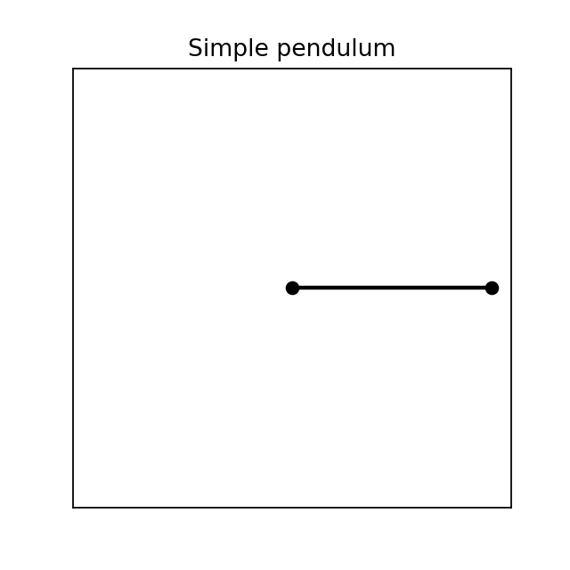
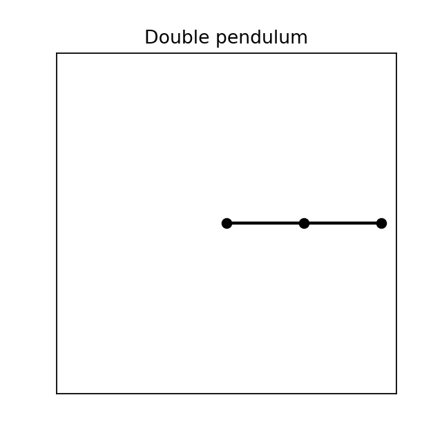
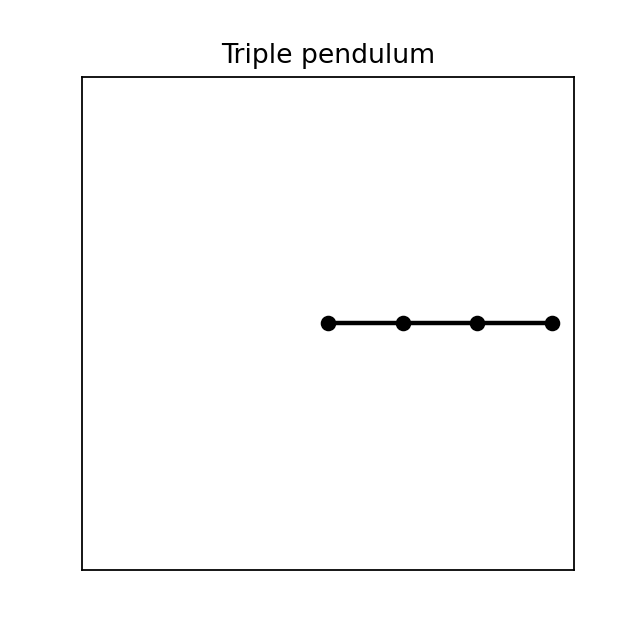
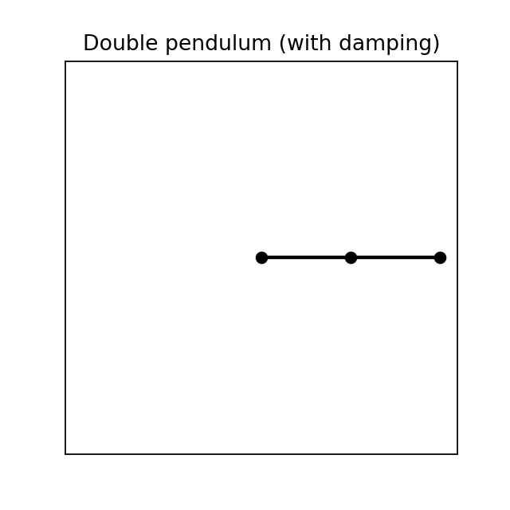

# Simulations de pendules

Le but de ce court projet est de se remémorer la manière de calculer l'équation du mouvement d'un pendule simple et d'un pendule double et d'un pendule triple en utilisant une librairie python (`sympy`) qui permet de résoudre les équations différentielles. Cette dernière approche permettra de généraliser le calcul et la résolution de ces équations à n'importe quel pendule. 

<p align="center">



</p>

**Librairies utilisées :**
- `matplotlib.pyplot`
- `matplotlib.animation`
- `numpy`
- `scipy.integrate`
- `sympy`

## 1.Le pendule simple

Pour le pendule simple, le mouvement est régit par l'équation suivante :

$\ddot \theta = - \dfrac{g}{l} sin\theta$

Cette équation n'a pas de solution analytique simple à cause du terme $\sin\theta$. Dans l'approximation des petits angles ($\sin\theta \approx \theta$), elle se linéarise en $\ddot\theta + \omega_0^2 \theta = 0$ avec $\omega_0 = \sqrt{g/l}$, ce qui donne la période classique $T_0 = 2\pi\sqrt{l/g}$.

## 2. Le pendule double 

Pour le pendule double, le mouvement est régit par deux équations différentielles non-linéaires. Pour les calculer, on utilise la formule du Lagrangien : 

$L = T - V $

Soit, 

$L = (m_1 + m_2)\left( \dfrac{1}{2} l_1^2 \dot \theta_1^2 + gl_1cos\theta_1 \right) + m_2 \left ( \dfrac{1}{2}l_2^2 \dot \theta_2^2 + l_1 l_2 \dot \theta_1 \dot \theta_2 cos(\theta_1 - \theta_2) + g l_2 cos\theta_2 \right )$


avec $T$ est l'énergie cinétique et $V$ l'énergie potentielle.

Puis on trouve les équations grâce à la formule d'Euler-Lagrange :

Pour $i \in \llbracket 1 ;2 \rrbracket$ :

$\dfrac{d}{dt} \left( \dfrac{\partial L}{\partial \dot\theta_i} \right) - \dfrac{\partial L}{\partial \theta_i} = 0$

Ceci permet d'obtenir les équations du mouvement pour $\ddot \theta_1$ et $\ddot \theta_2$ :

$\begin{cases}
(m1+m2)l_1 \ddot \theta_1 + m_2l_2cos(\theta_1-\theta_2)\ddot \theta_2 + (m1+m2)gsin\theta_1 + m_2 l_2 sin(\theta_1-\theta_2) \dot \theta_2^2 = 0 \\\\
l_2\ddot\theta_2 + l_1cos(\theta1-\theta_2)\ddot\theta_1 - l_1sin(\theta_1-\theta_2)\dot\theta_1^2 + gsin(\theta_2)=0
\end{cases}$

À ce niveau là les deux équations sont encore non linéaires. Pour les linéariser, on utilise la méthode de Cramer avec les déterminants.


## 3. Le pendule triple 

Pour le pendule triple, les équations comportent beaucoup plus de termes et deviennent plus fastidieuses à calculer à la main. Pour y remédier, on utilise le module `sympy`, qui permet de faire du calcul symbolique : construction du Lagrangien, dérivation automatique via Euler-Lagrange, puis extraction du système linéaire en $\ddot\theta_i$ sous forme matricielle $M \cdot \ddot\theta = b$ (via `linear_eq_to_matrix`). Ce système est ensuite converti en fonctions numériques rapides avec `lambdify`, et résolu à chaque pas de temps avec `np.linalg.solve`.


## 4. Généralisation 

Enfin, on se sert de la méthode utilisée pour le pendule triple et on la généralise pour un pendule de n tiges et n masses. Le travail n'est pas très compliqué une fois le pendule triple réalisé : il consiste à utiliser des listes de symboles (`l_i`, `m_i`, `theta_i`) et à boucler sur le nombre de pendules souhaité pour construire $T$, $V$, $L$, puis les n équations d'Euler-Lagrange.

Les positions cartésiennes de chaque masse sont obtenues par sommation cumulative des contributions de chaque tige précédente :

$$x_i = \sum_{k=1}^{i} l_k \sin\theta_k \qquad y_i = -\sum_{k=1}^{i} l_k \cos\theta_k$$

## 5. Frottements visqueux

Pour rendre les simulations plus réalistes (amortissement progressif des oscillations), on ajoute un frottement visqueux à chaque articulation, via la fonction de dissipation de Rayleigh :

$$D = \dfrac{1}{2}\sum_i c_i \dot\theta_i^2$$

L'équation de Lagrange devient alors :

$$\dfrac{d}{dt} \left( \dfrac{\partial L}{\partial \dot\theta_i} \right) - \dfrac{\partial L}{\partial \theta_i} + \dfrac{\partial D}{\partial \dot\theta_i} = 0$$

Ce qui revient simplement à ajouter le terme $c_i \dot\theta_i$ à chaque équation du mouvement, sans toucher au Lagrangien lui-même (le frottement est une force non conservative, donc elle n'a pas sa place dans $T - V$). Avec $c_i = 0$ pour tout $i$, on retrouve le comportement non amorti.

<p align="center">


</p>

## 6. Validation des simulations

Pour s'assurer que les équations et l'intégration numérique sont correctes, plusieurs vérifications sont utilisées tout au long du projet :

- **Conservation de l'énergie** : sans frottement, $E = T + V$ doit rester constante au cours du temps (à la précision de l'intégrateur près) ; avec frottement, $E$ doit décroître de façon strictement monotone.


- **Sensibilité aux conditions initiales** : deux simulations partant d'angles initiaux quasi identiques (écart de l'ordre de $10^{-5}$ rad) doivent diverger de façon exponentielle après un certain temps — signature caractéristique du chaos.

## 7. Utilisation

```python
from pendulum import Pendulum
import numpy as np

# Pendule triple, longueurs et masses égales à 1, sans frottement
pendule = Pendulum(order=3, length=[1,1,1], mass=[1,1,1])

U_0 = [np.pi/2, 0, np.pi/2, 0, np.pi/2, 0]  # [theta1, omega1, theta2, omega2, theta3, omega3]
pendule.pendulum_solver(U_0, start=0, end=100, n_step=2000)
pendule.show_animation()
```

Avec frottement :

```python
pendule_amorti = Pendulum(order=3, length=[1,1,1], mass=[1,1,1], damping=[0.1, 0.1, 0.1])
```

<!-- ## 8. Pistes d'amélioration

- Portrait de phase $(\theta_i, \dot\theta_i)$ et section de Poincaré
- Calcul de l'exposant de Lyapunov pour quantifier le chaos
- Modèle de frottement de pivot (dépendant de la vitesse relative entre deux tiges, plus réaliste mécaniquement qu'un frottement absolu) -->